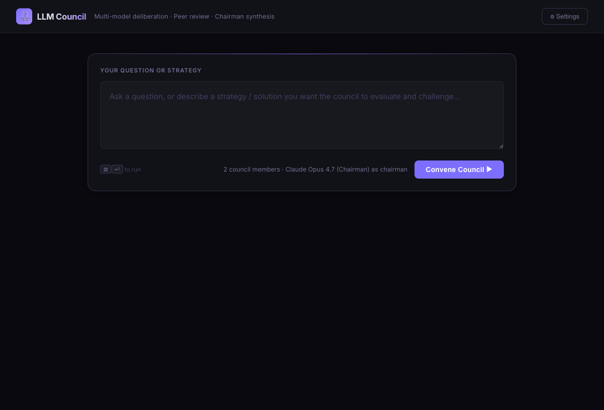
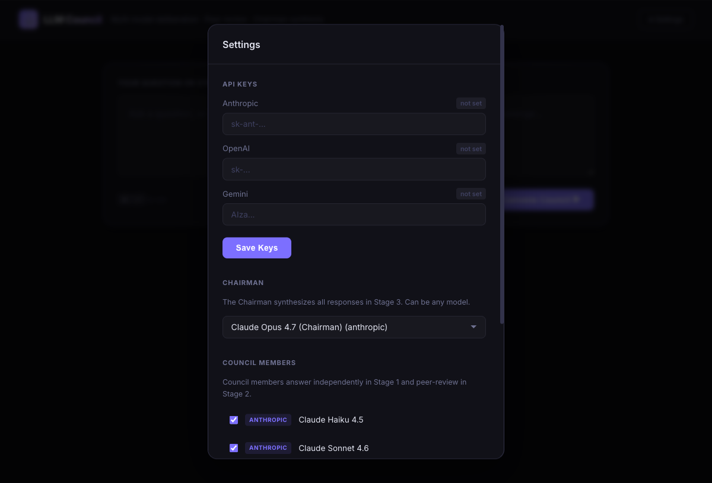

# ⚖️ LLM Council


Instead of asking one model a question, you convene a **council** of models that answer independently, peer-review each other, and have a chosen **Chairman** synthesize a final verdict.





---

## How it works

| Stage | What happens |
|---|---|
| **Stage 1** | Every council member answers your question independently |
| **Stage 2** | Each member peer-reviews the others' answers (identities hidden to prevent brand bias) |
| **Stage 3** | The Chairman reads everything and produces a single synthesized final answer |

---

## Features

- **Mix any models** — Claude (Haiku, Sonnet, Opus), GPT-4o, GPT-4o Mini, Gemini 2.0 Flash, Gemini 1.5 Pro
- **Configurable Chairman** — pick any model as the Stage 3 synthesizer
- **Live key management** — paste API keys directly in the UI, no restart needed
- **Per-provider color coding** — purple (Anthropic), green (OpenAI), blue (Gemini)
- **No build step** — plain HTML/CSS/JS frontend served by FastAPI

---

## Prerequisites

- Python 3.10+
- At least one API key:
  - **Anthropic** → [console.anthropic.com](https://console.anthropic.com)
  - **OpenAI** → [platform.openai.com](https://platform.openai.com)
  - **Gemini** → [aistudio.google.com](https://aistudio.google.com)

---

## Setup (5 minutes)

### 1. Clone the repo

```bash
git clone https://github.com/amartya2969/llm-council.git
cd llm-council
```

### 2. Install Python dependencies

```bash
cd backend
pip install -r requirements.txt
```

> **Using `uv`?** Run `uv pip install -r requirements.txt` instead.

### 3. (Optional) Add API keys via `.env`

```bash
cp .env.example .env
# Edit .env and paste your keys
```

Or skip this — you can paste keys directly in the UI after starting the server.

### 4. Start the server

```bash
# From the backend/ directory
uvicorn main:app --reload
```

The app is now running at **http://localhost:8000**

---

## Usage

1. Open **http://localhost:8000** in your browser
2. Click **⚙ Settings** → paste your API key(s) → **Save Keys**
3. Under **Chairman**, choose which model synthesizes the final answer
4. Under **Council Members**, check which models join the debate
5. Type your question or strategy in the text box
6. Hit **Convene Council ▶** (or `⌘ + Enter`)
7. Watch Stage 1 → Stage 2 → Chairman tabs fill in

---

## Project structure

```
llm-council/
├── backend/
│   ├── main.py          # FastAPI app — endpoints and key management
│   ├── council.py       # 3-stage orchestration logic
│   ├── providers.py     # Anthropic / OpenAI / Gemini provider abstractions
│   └── requirements.txt
├── frontend/
│   ├── index.html       # Single-page UI (no build step)
│   ├── style.css
│   └── app.js
└── .env.example
```

---

## Supported models

| Model | Provider | Role |
|---|---|---|
| Claude Haiku 4.5 | Anthropic | Council member |
| Claude Sonnet 4.6 | Anthropic | Council member |
| Claude Opus 4.7 | Anthropic | Council member / Chairman |
| GPT-4o | OpenAI | Council member / Chairman |
| GPT-4o Mini | OpenAI | Council member |
| Gemini 2.0 Flash | Google | Council member |
| Gemini 1.5 Pro | Google | Council member / Chairman |

---

## Cost

Each council run makes `(N council members × 2) + 1` API calls — two per member (Stage 1 answer + Stage 2 review) and one for the Chairman. With Haiku + Sonnet as members and Opus as Chairman, a typical run costs **~$0.05–0.15**.

---

## Customising the peer review prompt

The most impactful tuning knob is the `STAGE2_USER_TEMPLATE` in [`backend/council.py`](backend/council.py). This is what every council member reads when evaluating the others. Try making it more adversarial, structured, or Socratic — it changes the character of the whole council.

---

## License

MIT
